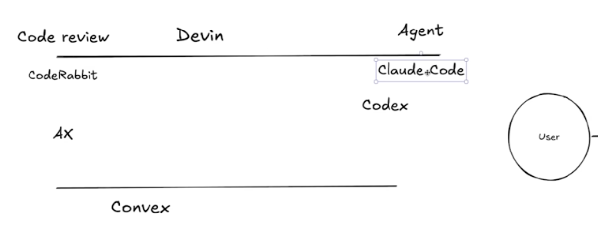

# claude-code-best-practice
your best ai assistant with the best practice

## CONCEPTS

> **Note:** Custom slash commands have been merged into skills. Files in `.claude/commands/` still work, but skills (`.claude/skills/`) are recommended as they support additional features like supporting files, invocation control, and subagent execution.

- **[Skills](https://code.claude.com/docs/en/skills)** - Reusable knowledge, workflows, and slash commands that Claude can load on-demand or you invoke with `/skill-name`
- **[Subagents](https://code.claude.com/docs/en/sub-agents)** - Isolated execution contexts that run their own loops and return summarized results
- **[Memory](https://code.claude.com/docs/en/memory)** - Persistent context via CLAUDE.md files and `@path` imports that Claude sees every session
- **[Rules](https://code.claude.com/docs/en/memory#modular-rules-with-clauderules)** - Modular topic-specific instructions in `.claude/rules/*.md` with optional path-scoping via frontmatter
- **[Hooks](https://code.claude.com/docs/en/hooks)** - Deterministic scripts that run outside the agentic loop on specific events
- **[MCP Servers](https://code.claude.com/docs/en/mcp)** - Model Context Protocol connections to external tools, databases, and APIs
- **[Plugins](https://code.claude.com/docs/en/plugins)** - Distributable packages that bundle skills, subagents, hooks, and MCP servers
- **[Marketplaces](https://code.claude.com/docs/en/discover-plugins)** - Host and discover plugin collections
- **[Settings](https://code.claude.com/docs/en/settings)** - Hierarchical configuration system for Claude Code behavior
- **[Permissions](https://code.claude.com/docs/en/iam)** - Fine-grained access control for tools and operations

**Extension Overview:** See [Extend Claude Code](https://code.claude.com/docs/en/features-overview) for when to use each feature and how they layer together.

## LESSON LEARNED

### My Experience

■ **Workflows**
- Claude.md should not exceed 150+ lines. (still not 100% guarenteed)
- have feature specific subagents (extra context) with skills (progressive disclosure) instead of general qa, backend engineer.
- /memory, /rules, constitution.md does not guarentee anything
- do manual /compact at max 50%
- always start with plan mode
- use human pass gated todo list workflow
- subtasks should be so small that it can be completed in less than 50% context
- vanilla cc is better than any workflows with smaller tasks

■ **Utilities**
- iTerm terminal instead of IDE (crash issue) 
- Wispr Flow for voice prompting (10x productivity)
- claude-code-voice-hooks for claude feedback
- status line for context awareness and fast compacting
- use git worktress
- use /config dont ask permission mode instead of dangerously—skip--permissions

■ **Debugging** 
- /doctor
- always ask claude to run the terminal (you want to see logs of) as a background task for better debugging
- use mcp (claude in chrome, playwright, chrome dev tool) to let claude see chrome console logs on its own
- provide screenshots of the issue

### Context Engineering
- [Humanlayer - Writing a good Claude.Md](https://www.humanlayer.dev/blog/writing-a-good-claude-md)

### Workflows
- [Ralph plugin with sandbox](https://www.youtube.com/watch?v=eAtvoGlpeRU)
- [Human Layer RPI - Research Plan Implement](https://github.com/humanlayer/advanced-context-engineering-for-coding-agents/blob/main/ace-fca.md)
- [AgentOs - 2026 its overkill (Brian Casel)](https://www.youtube.com/watch?v=0hdFJA-ho3c)
- [Github Speckit](https://github.com/github/spec-kit)
- [GSD - Get Shit Done](https://github.com/glittercowboy/get-shit-done)
- [OpenSpec OPSX](https://github.com/Fission-AI/OpenSpec/blob/main/docs/opsx.md)
- [Superpower](https://github.com/obra/superpowers)

## LIBRARIES

- [Claude Code Tips](https://github.com/ykdojo/claude-code-tips)
- [Awesome Claude Code](https://github.com/hesreallyhim/awesome-claude-code)

## KEYWORDS

### Claude Keywords
- [btw] start prompt with btw to let the current task executing in background
- [claude --dangerously-skip-permissions] "defaultMode": "bypassPermissions"
- *deprecated** [ultrathink] Triggers extended thinking with up to ~32K thinking tokens for a single request.

### Community
- Agentic Workflow
- AI Slop
- Context Engineering
- Context Rot
- Dumb Zone
- Hallucination
- One Shot
- Rate Limit Jail / Cooldown
- Slot Machine Method = Save state → let Claude run → revert if bad results → try again
- The Holy Trinity = Skills + Agents + Hooks working together
- Token Burn
- Vibe Coding

## CLAUDE CODE FEATURES INSPIRATION

- [Claude Code Tasks - inspired by beats](https://www.reddit.com/r/ClaudeAI/comments/1qkjznp/anthropic_replaced_claude_codes_old_todos_with/) [Inspiration](https://github.com/steveyegge/beads)
- [Ralph Plugin](https://x.com/GeoffreyHuntley/status/2015031262692753449)

## SECURITY

- [Great talk at 39C3 on "Agentic ProbLLMs: Exploiting AI Computer-Use and Coding Agents"](https://www.reddit.com/r/cybersecurity/comments/1qannih/great_talk_at_39c3_on_agentic_probllms_exploiting/)

## DOCS

### **[docs/AGENTS.md](docs/AGENTS.md)** - Agent Orchestration Best Practices
Learn how to properly orchestrate multiple agents, avoid common pitfalls when sub-agents aren't invoking, and implement sequential workflows using the Task tool.

### **[docs/PROMPTS.md](docs/PROMPTS.md)** - Invocation Patterns Reference
Quick reference tables showing how to invoke agents and commands from different contexts (CLI, other agents, other commands).

### **[docs/WEATHER.md](docs/WEATHER.md)** - Weather System Flow Documentation
Complete system architecture and flow diagram for the weather data fetching and transformation workflow, demonstrating real-world agent and command orchestration.

## IDE

### Cursor vs. Windsurf vs. VS Code
[Claude Code Replaced Cursor for Me… Here’s Why](https://www.youtube.com/watch?v=0iGEpx8IeM0)

