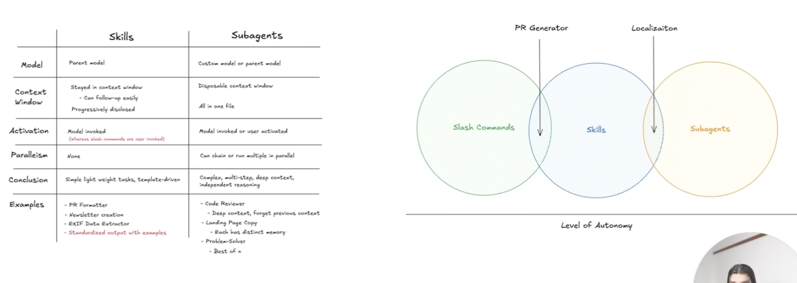

# claude-code-best-practice
your best ai assistant with the best practice

## Core Concepts

- **[Agents](https://docs.claude.com/en/docs/claude-code/agents)** - Specialized subprocesses that autonomously handle complex, multi-step tasks
- **[Commands](https://docs.claude.com/en/docs/claude-code/slash-commands)** - Custom slash commands to extend Claude Code with reusable prompts
- **[Memory](https://docs.claude.com/en/docs/claude-code/memory)** - Persistent context that Claude remembers across conversations
- **[Hooks](https://docs.claude.com/en/docs/claude-code/hooks)** - Shell commands that execute in response to events like tool calls
- **[Skills](https://docs.claude.com/en/docs/claude-code/skills)** - Installable capabilities that add specialized functionality to Claude Code
- **[Settings](https://docs.claude.com/en/docs/claude-code/settings)** - Hierarchical configuration system for Claude Code behavior
- **[MCP Servers](https://docs.claude.com/en/docs/claude-code/mcp)** - Model Context Protocol for connecting to external tools, databases, and APIs
- **[Plugins](https://docs.claude.com/en/docs/claude-code/plugins)** - Extensible packages that bundle commands, agents, skills, hooks, and MCP servers
- **[Rules](https://docs.claude.com/en/docs/claude-code/memory#project-rules)** - Modular topic-specific instructions in `.claude/rules/*.md`
- **[Output Styles](https://docs.claude.com/en/docs/claude-code/output-styles)** - Custom system prompt modifications for different use cases
- **[Permissions](https://docs.claude.com/en/docs/claude-code/permissions)** - Fine-grained access control for tools and operations

## Other Libraries

- [Claude Code Tips](https://github.com/ykdojo/claude-code-tips)
- [Awesome Claude Code](https://github.com/hesreallyhim/awesome-claude-code)

## Keywords

- [ultrathink] Triggers extended thinking with up to ~32K thinking tokens for a single request.
- [btw] start prompt with btw to let the current task executing in background

## Documentation

### **[docs/AGENTS.md](docs/AGENTS.md)** - Agent Orchestration Best Practices
Learn how to properly orchestrate multiple agents, avoid common pitfalls when sub-agents aren't invoking, and implement sequential workflows using the Task tool.

### **[docs/PROMPTS.md](docs/PROMPTS.md)** - Invocation Patterns Reference
Quick reference tables showing how to invoke agents and commands from different contexts (CLI, other agents, other commands).

### **[docs/WEATHER.md](docs/WEATHER.md)** - Weather System Flow Documentation
Complete system architecture and flow diagram for the weather data fetching and transformation workflow, demonstrating real-world agent and command orchestration.

## SKILLS
#### Skills vs. Agents | Commands | Memory
[Claude Code Skills: What Problem Do They Solve? - Brian Casel](https://www.youtube.com/watch?v=Z0DB0kCfNOM)

#### Types of Skills
[The REAL POWER of Claude Agent SKILLS - Grace Leung](https://youtu.be/m-5DjcgFmfQ)

#### Venn Diagram - Skills vs. Agents | Commands
[Claude Code Brand New Feature: Claude Skills - Ray Amjad](https://www.youtube.com/watch?v=v1y5EUSQ8WA)

## IDE

### Cursor vs. Windsurf vs. VS Code
[Claude Code Replaced Cursor for Me… Here’s Why](https://www.youtube.com/watch?v=0iGEpx8IeM0)

