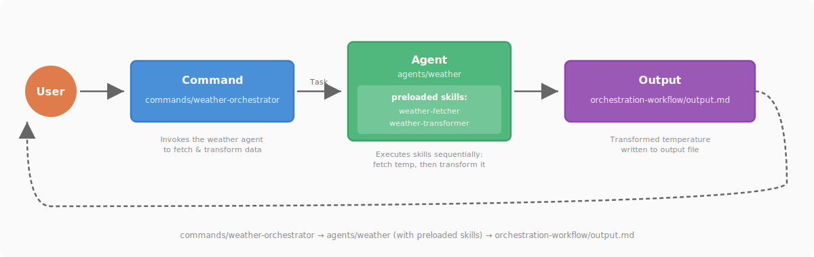

# claude-code-best-practice
practice makes claude perfect

 

 *Click on this badge to show the latest best practice* 
 *Click on this badge to show implementation in this repo* 
 *Click on this badge to see the Command → Agent → Skill orchestration workflow*

  

   
  <a href="https://x.com/bcherny/status/2007179832300581177">tweet 1</a> · <a href="https://x.com/bcherny/status/2017742741636321619">tweet 2</a> · <a href="https://x.com/bcherny/status/2021699851499798911">tweet 3</a>

## CONCEPTS

| Feature | Location | Description |
|---------|----------|-------------|
| [**Commands**](https://code.claude.com/docs/en/skills) | `.claude/commands/<name>.md` |   Entry-point prompts for workflows — invoke with `/command-name` |
| [**Sub-Agents**](https://code.claude.com/docs/en/sub-agents) | `.claude/agents/<name>.md` |   Custom agents with their own name, color, tools, permissions, and model · [Agent Teams](https://code.claude.com/docs/en/agent-teams) |
| [**Skills**](https://code.claude.com/docs/en/skills) | `.claude/skills/<name>/SKILL.md` |   Reusable knowledge, workflows, and slash commands — load on-demand or invoke with `/skill-name` |
| [**Workflows**](https://code.claude.com/docs/en/common-workflows) | [`.claude/commands/weather-orchestrator.md`](.claude/commands/weather-orchestrator.md) |  |
| [**Hooks**](https://code.claude.com/docs/en/hooks) | `.claude/hooks/` |   Deterministic scripts that run outside the agentic loop on specific events |
| [**MCP Servers**](https://code.claude.com/docs/en/mcp) | `.claude/settings.json`, `.mcp.json` |   Model Context Protocol connections to external tools, databases, and APIs |
| [**Plugins**](https://code.claude.com/docs/en/plugins) | distributable packages | Bundles of skills, subagents, hooks, and MCP servers · [Marketplaces](https://code.claude.com/docs/en/discover-plugins) |
| [**Settings**](https://code.claude.com/docs/en/settings) | `.claude/settings.json` |   Hierarchical configuration system · [Permissions](https://code.claude.com/docs/en/permissions) · [Model Config](https://code.claude.com/docs/en/model-config) · [Output Styles](https://code.claude.com/docs/en/output-styles) · [Sandboxing](https://code.claude.com/docs/en/sandboxing) · [Keybindings](https://code.claude.com/docs/en/keybindings) · [Fast Mode](https://code.claude.com/docs/en/fast-mode) |
| [**Status Line**](https://code.claude.com/docs/en/statusline) | `.claude/settings.json` |   Customizable status bar showing context usage, model, cost, and session info |
| [**Memory**](https://code.claude.com/docs/en/memory) | `CLAUDE.md`, `~/.claude/projects/<project>/memory/` |   Persistent context via CLAUDE.md files and `@path` imports · [Auto Memory](https://code.claude.com/docs/en/memory) · [Rules](https://code.claude.com/docs/en/memory#organize-rules-with-clauderules) |
| [**Checkpointing**](https://code.claude.com/docs/en/checkpointing) | automatic (git-based) | Automatic tracking of file edits with rewind (`Esc Esc` or `/rewind`) and targeted summarization |
| [**Remote Control**](https://code.claude.com/docs/en/remote-control) | CLI / claude.ai | Continue local sessions from any device — phone, tablet, or browser · [Headless Mode](https://code.claude.com/docs/en/headless) |
| [**CLI Startup Flags**](https://code.claude.com/docs/en/cli-reference) | `claude [flags]` |  Command-line flags, subcommands, and environment variables for launching Claude Code |
| **AI Terms** | |  Agentic Engineering · Context Engineering · Vibe Coding |
| [**Best Practices**](https://code.claude.com/docs/en/best-practices) | | Official best practices · [Extend Claude Code](https://code.claude.com/docs/en/features-overview) |

## 

Workflow orchestration using the **Command → Agent → Skill** pattern.

  

| Component | Role | Example |
|-----------|------|---------|
| **Command** | Entry point, user interaction | [`/weather-orchestrator`](.claude/commands/weather-orchestrator.md) |
| **Agent** | Fetches data with preloaded skill (agent skill) | [`weather-agent`](.claude/agents/weather-agent.md) with [`weather-fetcher`](.claude/skills/weather-fetcher/SKILL.md) |
| **Skill** | Creates output independently (skill) | [`weather-svg-creator`](.claude/skills/weather-svg-creator/SKILL.md) |

See [orchestration-workflow](orchestration-workflow/orchestration-workflow.md) for implementation details.

## DEVELOPMENT WORKFLOW
- [RPI](workflow/rpi/rpi-workflow.md) 
- [Boris Feb26 workflow](https://x.com/bcherny/status/2017742741636321619)
- [Ralph plugin with sandbox](https://www.youtube.com/watch?v=eAtvoGlpeRU) 
- [Human Layer RPI - Research Plan Implement](https://github.com/humanlayer/advanced-context-engineering-for-coding-agents/blob/main/ace-fca.md)
- [AgentOs - 2026 its overkill (Brian Casel)](https://www.youtube.com/watch?v=0hdFJA-ho3c)
- [Github Speckit](https://github.com/github/spec-kit)
- [GSD - Get Shit Done](https://github.com/glittercowboy/get-shit-done)
- [OpenSpec OPSX](https://github.com/Fission-AI/OpenSpec/blob/main/docs/opsx.md)
- [Superpower](https://github.com/obra/superpowers)
- [Andrej Karpathy Workflow](https://github.com/forrestchang/andrej-karpathy-skills)
- [Creator of Clawd Bot Workflow](https://www.youtube.com/watch?v=8lF7HmQ_RgY)

## TIPS AND TRICKS

■ **Workflows**
- Claude.md should not exceed 150+ lines. (still not 100% guaranteed)
- use commands for your workflows instead of agents
- have feature specific subagents (extra context) with skills (progressive disclosure) instead of general qa, backend engineer.
- /memory, /rules, constitution.md does not guarantee anything
- do manual /compact at max 50%
- always start with plan mode
- subtasks should be so small that it can be completed in less than 50% context
- vanilla cc is better than any workflows with smaller tasks
- commit often, as soon as task is completed, commit.

■ **Utilities**
- iTerm terminal instead of IDE (crash issue) 
- Wispr Flow for voice prompting (10x productivity)
- claude-code-voice-hooks for claude feedback
- status line for context awareness and fast compacting
- git worktrees for parallel development
- /permissions with wildcard syntax (`Bash(npm run *)`, `Edit(/docs/**)`) instead of dangerously-skip-permissions
- /sandbox to reduce permission prompts with file and network isolation
- output styles: use Explanatory when learning a new codebase, Learning for coaching
- /keybindings to remap any key, settings live reload

■ **Debugging** 
- /doctor
- always ask claude to run the terminal (you want to see logs of) as a background task for better debugging
- use mcp (claude in chrome, playwright, chrome dev tool) to let claude see chrome console logs on its own
- provide screenshots of the issue

- [Feb 2026 - 12 Tips](reports/claude-boris-tips-feb-26.md) ([Reddit thread](https://www.reddit.com/r/ClaudeAI/comments/1r2m8ma/12_claude_code_tips_from_creator_of_claude_code/))

## REPORTS

| Report | Description |
|--------|-------------|
| [Agent SDK vs CLI System Prompts](reports/claude-agent-sdk-vs-cli-system-prompts.md) | Why Claude CLI and Agent SDK outputs may differ—system prompt architecture and determinism |
| [Browser Automation MCP Comparison](reports/claude-in-chrome-v-chrome-devtools-mcp.md) | Comparison of Playwright, Chrome DevTools, and Claude in Chrome for automated testing |
| [Global vs Project Settings](reports/claude-global-vs-project-settings.md) | Which features are global-only (`~/.claude/`) vs dual-scope, including Tasks and Agent Teams |
| [Skills Discovery in Monorepos](reports/claude-skills-for-larger-mono-repos.md) | How skills are discovered and loaded in large monorepo projects |
| [Agent Memory Frontmatter](reports/claude-agent-memory.md) | Persistent memory scopes (`user`, `project`, `local`) for subagents — enabling agents to learn across sessions |
| [Boris Cherny's 12 Customization Tips](reports/claude-boris-tips-feb-26.md) | 12 ways to customize Claude Code — from terminal config to plugins, agents, hooks, and output styles |
| [Advanced Tool Use Patterns](reports/claude-advanced-tool-use.md) | Programmatic Tool Calling (PTC), Tool Search, and Tool Use Examples |
| [Usage, Rate Limits & Extra Usage](reports/claude-usage-and-rate-limits.md) | Usage commands (`/usage`, `/extra-usage`, `/cost`), rate limits, and pay-as-you-go overflow billing |
