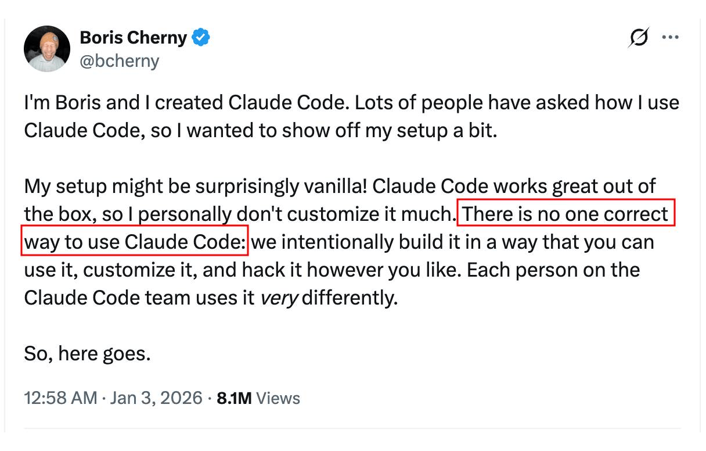
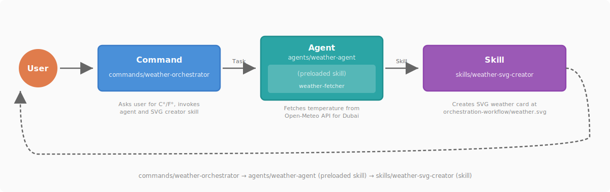

# claude-code-best-practice（Claude Code 最佳实践）
熟能生巧，让 Claude 更完美

-white?style=flat&labelColor=555) <a href="https://github.com/shanraisshan/claude-code-best-practice/stargazers"></a><br>

[](best-practice/) [](implementation/) [](orchestration-workflow/orchestration-workflow.md) [](#-技巧和窍门) <br>
 = 代理 (Agents) ·  = 命令 (Commands) ·  = 技能 (Skills)

<p align="center">
  <br>
  <a href="https://github.com/trending"></a>
</p>

<p align="center">
  <br>
  Boris Cherny on X (<a href="https://x.com/bcherny/status/2007179832300581177">tweet 1</a> · <a href="https://x.com/bcherny/status/2017742741636321619">tweet 2</a> · <a href="https://x.com/bcherny/status/2021699851499798911">tweet 3</a>)
</p>


## 🧠 核心概念

| 功能特性 | 位置 | 描述 |
|---------|----------|-------------|
|  [**子代理 (Subagents)**](https://code.claude.com/docs/en/sub-agents) | `.claude/agents/<name>.md` | [](best-practice/claude-subagents.md) [](implementation/claude-subagents-implementation.md) 在全新隔离上下文中的自主执行者 —— 可自定义工具、权限、模型、内存和持久身份 |
|  [**命令 (Commands)**](https://code.claude.com/docs/en/slash-commands) | `.claude/commands/<name>.md` | [](best-practice/claude-commands.md) [](implementation/claude-commands-implementation.md) 注入到现有上下文的知识 —— 用于工作流编排的简单用户调用提示模板 |
|  [**技能 (Skills)**](https://code.claude.com/docs/en/skills) | `.claude/skills/<name>/SKILL.md` | [](best-practice/claude-skills.md) [](implementation/claude-skills-implementation.md) 注入到现有上下文的知识 —— 可配置、可预加载、可自动发现，支持上下文分叉和渐进式披露 · [官方技能库](https://github.com/anthropics/skills/tree/main/skills) |
| [**工作流 (Workflows)**](https://code.claude.com/docs/en/common-workflows) | [`.claude/commands/weather-orchestrator.md`](.claude/commands/weather-orchestrator.md) | [](orchestration-workflow/orchestration-workflow.md) |
| [**钩子 (Hooks)**](https://code.claude.com/docs/en/hooks) | `.claude/hooks/` | [](https://github.com/shanraisshan/claude-code-hooks) [](https://github.com/shanraisshan/claude-code-hooks) 用户定义的处理器（脚本、HTTP、提示、代理），在特定事件发生时在代理循环外运行 · [指南](https://code.claude.com/docs/en/hooks-guide) |
| [**MCP 服务器**](https://code.claude.com/docs/en/mcp) | `.claude/settings.json`, `.mcp.json` | [](best-practice/claude-mcp.md) [](.mcp.json) 模型上下文协议连接到外部工具、数据库和 API |
| [**插件 (Plugins)**](https://code.claude.com/docs/en/plugins) | 可分发包 | 技能、子代理、钩子、MCP 服务器和 LSP 服务器的集合 · [市场](https://code.claude.com/docs/en/discover-plugins) · [创建市场](https://code.claude.com/docs/en/plugin-marketplaces) |
| [**设置 (Settings)**](https://code.claude.com/docs/en/settings) | `.claude/settings.json` | [](best-practice/claude-settings.md) [](.claude/settings.json) 分层配置系统 · [权限](https://code.claude.com/docs/en/permissions) · [模型配置](https://code.claude.com/docs/en/model-config) · [输出样式](https://code.claude.com/docs/en/output-styles) · [沙箱](https://code.claude.com/docs/en/sandboxing) · [快捷键](https://code.claude.com/docs/en/keybindings) · [快速模式](https://code.claude.com/docs/en/fast-mode) |
| [**状态栏 (Status Line)**](https://code.claude.com/docs/en/statusline) | `.claude/settings.json` | [](https://github.com/shanraisshan/claude-code-status-line) [](.claude/settings.json) 可自定义的状态栏，显示上下文使用情况、模型、成本和会话信息 |
| [**记忆 (Memory)**](https://code.claude.com/docs/en/memory) | `CLAUDE.md`, `.claude/rules/`, `~/.claude/rules/`, `~/.claude/projects/<project>/memory/` | [](best-practice/claude-memory.md) [](CLAUDE.md) 通过 CLAUDE.md 文件和 `@path` 导入的持久上下文 · [自动记忆](https://code.claude.com/docs/en/memory) · [规则](https://code.claude.com/docs/en/memory#organize-rules-with-clauderules) |
| [**检查点 (Checkpointing)**](https://code.claude.com/docs/en/checkpointing) | 自动（基于 git） | 自动跟踪文件编辑，支持回退（`Esc Esc` 或 `/rewind`）和针对性总结 |
| [**CLI 启动标志**](https://code.claude.com/docs/en/cli-reference) | `claude [flags]` | [](best-practice/claude-cli-startup-flags.md) 启动 Claude Code 的命令行标志、子命令和环境变量 · [交互模式](https://code.claude.com/docs/en/interactive-mode) |
| **AI 术语** | | [](https://github.com/shanraisshan/claude-code-codex-cursor-gemini/blob/main/reports/ai-terms.md) 代理工程 · 上下文工程 · Vibe Coding |
| [**最佳实践**](https://code.claude.com/docs/en/best-practices) | | 官方最佳实践 · [提示工程](https://github.com/anthropics/prompt-eng-interactive-tutorial) · [扩展 Claude Code](https://code.claude.com/docs/en/features-overview) |

### 🔥 热门功能

| 功能特性 | 位置 | 描述 |
|---------|----------|-------------|
| [**Power-ups（能力提升）**](best-practice/claude-power-ups.md) | `/powerup` | [](best-practice/claude-power-ups.md) 通过动画演示教授 Claude Code 功能的交互式课程（v2.1.90）|
| [**无闪烁模式**](https://code.claude.com/docs/en/fullscreen)  | `CLAUDE_CODE_NO_FLICKER=1` | [](https://x.com/bcherny/status/2039421575422980329) 无闪烁的全屏渲染，支持鼠标、稳定内存和应用内滚动 —— 选择性研究预览 |
| [**计算机使用 (Computer Use)**](https://code.claude.com/docs/en/computer-use)  | `computer-use` MCP server | 让 Claude 控制你的屏幕 —— 在 macOS 上打开应用、点击、输入和截屏 · [桌面版](https://code.claude.com/docs/en/desktop#let-claude-use-your-computer) |
| [**自动模式 (Auto Mode)**](https://code.claude.com/docs/en/permission-modes#eliminate-prompts-with-auto-mode)  | `claude --enable-auto-mode` | [](https://x.com/claudeai/status/2036503582166393240) 后台安全分类器取代手动权限提示 —— Claude 自行决定安全操作，同时阻止提示注入和风险升级 · 使用 `claude --enable-auto-mode`（或 `--permission-mode auto`）启动，或在会话期间按 `Shift+Tab` 切换 · [博客](https://claude.com/blog/auto-mode) |
| [**频道 (Channels)**](https://code.claude.com/docs/en/channels)  | `--channels`, 基于插件 | 将来自 Telegram、Discord 或 webhook 的事件推送到运行中的会话 —— 即使你不在时 Claude 也能响应 · [参考](https://code.claude.com/docs/en/channels-reference) |
| [**Slack 集成**](https://code.claude.com/docs/en/slack) | `@Claude` in Slack | 在团队聊天中提及 @Claude 并分配编程任务 —— 路由到 Claude Code Web 会话进行 bug 修复、代码审查和并行任务执行 |
| [**代码审查 (Code Review)**](https://code.claude.com/docs/en/code-review)  | GitHub App（托管） | [](https://x.com/claudeai/status/2031088171262554195) 多代理 PR 分析，捕获 bug、安全漏洞和回归问题 · [博客](https://claude.com/blog/code-review) |
| [**GitHub Actions**](https://code.claude.com/docs/en/github-actions) | `.github/workflows/` | 在 CI/CD 流水线中自动化 PR 审查、问题分类和代码生成 · [GitLab CI/CD](https://code.claude.com/docs/en/gitlab-ci-cd) |
| [**Chrome 集成**](https://code.claude.com/docs/en/chrome)  | `--chrome`, extension | [](reports/claude-in-chrome-v-chrome-devtools-mcp.md) 通过 Claude in Chrome 实现浏览器自动化 —— 测试 Web 应用、使用控制台调试、自动化表单、从页面提取数据 |
| [**计划任务 (Scheduled Tasks)**](https://code.claude.com/docs/en/scheduled-tasks) | `/loop`, `/schedule`, cron tools | [](https://x.com/bcherny/status/2030193932404150413) [](implementation/claude-scheduled-tasks-implementation.md) `/loop` 在本地按定期计划运行提示（最多 3 天）· [`/schedule`](https://code.claude.com/docs/en/web-scheduled-tasks) 在 Anthropic 云基础设施上运行提示 —— 即使机器关闭也能工作 · [公告](https://x.com/noahzweben/status/2036129220959805859) |
| [**语音听写 (Voice Dictation)**](https://code.claude.com/docs/en/voice-dictation)  | `/voice` | [](https://x.com/trq212/status/2028628570692890800) 按键说话的语音输入提示，支持 20 种语言和可重新绑定的激活键 |
| [**简化与批处理 (Simplify & Batch)**](https://code.claude.com/docs/en/skills#bundled-skills) | `/simplify`, `/batch` | [](https://x.com/bcherny/status/2027534984534544489) 用于代码质量和批量操作的内置技能 —— 简化重构以提高复用性和效率，批量在多个文件中运行命令 |
| [**代理团队 (Agent Teams)**](https://code.claude.com/docs/en/agent-teams)  | 内置（环境变量） | [](https://x.com/bcherny/status/2019472394696683904) [](implementation/claude-agent-teams-implementation.md) 多个代理并行工作在同一代码库上，具有共享任务协调 |
| [**远程控制 (Remote Control)**](https://code.claude.com/docs/en/remote-control) | `/remote-control`, `/rc` | [](https://x.com/noahzweben/status/2032533699116355819) 从任何设备继续本地会话 —— 手机、平板或浏览器 · [无头模式](https://code.claude.com/docs/en/headless) |
| [**Git Worktrees（工作树）**](https://code.claude.com/docs/en/common-workflows#run-parallel-claude-code-sessions-with-git-worktrees) | 内置 | [](https://x.com/bcherny/status/2025007393290272904) 用于并行开发的隔离 git 分支 —— 每个代理获得自己的工作副本 |
| [**Ralph Wiggum 循环**](https://github.com/anthropics/claude-code/tree/main/plugins/ralph-wiggum) | plugin | [](https://github.com/ghuntley/how-to-ralph-wiggum) [](https://github.com/shanraisshan/novel-llm-26) 用于长时间运行任务的自主开发循环 —— 迭代直到完成 |

<p align="center">
  
</p>

<a id="orchestration-workflow"></a>

## <a href="orchestration-workflow/orchestration-workflow.md"></a>

查看 [orchestration-workflow](orchestration-workflow/orchestration-workflow.md) 了解  **命令 (Command)** →  **代理 (Agent)** →  **技能 (Skill)** 模式的实现细节。


<p align="center">
  
</p>

<p align="center">
  
</p>


```bash
claude
/weather-orchestrator
```

<p align="center">
  
</p>

## ⚙️ 开发工作流

所有主要工作流都汇聚到相同的架构模式：**研究 → 计划 → 执行 → 审查 → 发布**

| 名称 | ★ | 独特性 | 计划 |  |  |  |
|------|---|------------|------|---|---|---|
| [Everything Claude Code](https://github.com/affaan-m/everything-claude-code) | 133k |    |  [planner](https://github.com/affaan-m/everything-claude-code/blob/main/agents/planner.md) | 36 | 68 | 152 |
| [Superpowers](https://github.com/obra/superpowers) | 132k |    |  [writing-plans](https://github.com/obra/superpowers/tree/main/skills/writing-plans) | 5 | 3 | 14 |
| [Spec Kit](https://github.com/github/spec-kit) | 85k |    |  [speckit.plan](https://github.com/github/spec-kit/blob/main/templates/commands/plan.md) | 0 | 9+ | 0 |
| [gstack](https://github.com/garrytan/gstack) | 62k |    |  [autoplan](https://github.com/garrytan/gstack/tree/main/autoplan) | 0 | 0 | 33 |
| [Get Shit Done](https://github.com/gsd-build/get-shit-done) | 47k |    |  [gsd-planner](https://github.com/gsd-build/get-shit-done/blob/main/agents/gsd-planner.md) | 21 | 59 | 0 |
| [BMAD-METHOD](https://github.com/bmad-code-org/BMAD-METHOD) | 43k |    |  [bmad-create-prd](https://github.com/bmad-code-org/BMAD-METHOD/tree/main/src/bmm-skills/2-plan-workflows/bmad-create-prd) | 0 | 0 | 40 |
| [OpenSpec](https://github.com/Fission-AI/OpenSpec) | 37k |    |  [opsx:propose](https://github.com/Fission-AI/OpenSpec/blob/main/src/commands/workflow/new-change.ts) | 0 | 11 | 0 |
| [Compound Engineering](https://github.com/EveryInc/compound-engineering-plugin) | 13k |    |  [ce-plan](https://github.com/EveryInc/compound-engineering-plugin/tree/main/plugins/compound-engineering/skills/ce-plan) | 49 | 4 | 42 |
| [HumanLayer](https://github.com/humanlayer/humanlayer) | 10k |    |  [create_plan](https://github.com/humanlayer/humanlayer/blob/main/.claude/commands/create_plan.md) | 6 | 27 | 0 |

### 其他工作流
- [跨模型（Claude Code + Codex）工作流](development-workflows/cross-model-workflow/cross-model-workflow.md) [](development-workflows/cross-model-workflow/cross-model-workflow.md)
- [RPI](development-workflows/rpi/rpi-workflow.md) [](development-workflows/rpi/rpi-workflow.md)
- [Ralph Wiggum Loop](https://www.youtube.com/watch?v=eAtvoGlpeRU) [](https://github.com/shanraisshan/novel-llm-26)
- [Andrej Karpathy（OpenAI 创始成员）工作流](https://x.com/karpathy/status/2015883857489522876)
- [Peter Steinberger（OpenClaw 创建者）工作流](https://youtu.be/8lF7HmQ_RgY?t=2582)
- Boris Cherny（Claude Code 创建者）工作流 —— [13 个技巧](tips/claude-boris-13-tips-03-jan-26.md) · [10 个技巧](tips/claude-boris-10-tips-01-feb-26.md) · [12 个技巧](tips/claude-boris-12-tips-12-feb-26.md) · [2 个技巧](tips/claude-boris-2-tips-25-mar-26.md) · [15 个技巧](tips/claude-boris-15-tips-30-mar-26.md) [](https://x.com/bcherny)

<p align="center">
  
</p>

## 💡 技巧和窍门 (87 条)

🚫👶 = 不要保姆式干预

[提示工程](#tips-prompting) · [规划](#tips-planning) · [CLAUDE.md](#tips-claudemd) · [代理](#tips-agents) · [命令](#tips-commands) · [技能](#tips-skills) · [钩子](#tips-hooks) · [工作流](#tips-workflows) · [高级](#tips-workflows-advanced) · [Git / PR](#tips-git-pr) · [调试](#tips-debugging) · [实用工具](#tips-utilities) · [日常](#tips-daily)


<a id="tips-prompting"></a>■ **提示工程 (3)**

| 技巧 | 来源 |
|-----|--------|
| 挑战 Claude —— "对这些更改进行严格审查，在我通过你的测试之前不要创建 PR"或"向我证明这能工作"，让 Claude 对比 main 分支和你的分支 🚫👶 | [](https://x.com/bcherny/status/2017742752566632544) |
| 在平庸的修复之后 —— "基于你现在知道的一切，丢弃这个并实现优雅的解决方案" 🚫👶 | [](https://x.com/bcherny/status/2017742752566632544) |
| Claude 能自己修复大多数 bug —— 粘贴 bug，说"修复"，不要微观管理如何修 🚫👶 | [](https://x.com/bcherny/status/2017742750473720121) |

<a id="tips-planning"></a>■ **规划/规格 (6)**

| 技巧 | 来源 |
|-----|--------|
| 总是从[计划模式](https://code.claude.com/docs/en/common-workflows)开始 | [](https://x.com/bcherny/status/2007179845336527000) |
| 从最小规格或提示开始，让 Claude 使用 [AskUserQuestion](https://code.claude.com/docs/en/cli-reference) 工具采访你，然后创建新会话执行规格 | [](https://x.com/trq212/status/2005315275026260309) |
| 总是制定分阶段的门控计划，每个阶段都有多个测试（单元、自动化、集成）| |
| 启动第二个 Claude 作为资深工程师审查你的计划，或使用[跨模型](development-workflows/cross-model-workflow/cross-model-workflow.md)进行审查 | [](https://x.com/bcherny/status/2017742745365057733) |
| 在移交工作之前编写详细规格并减少歧义 —— 你越具体，输出越好 | [](https://x.com/bcherny/status/2017742752566632544) |
| 原型 > PRD —— 构建 20-30 个版本而不是编写规格，构建成本低所以多尝试几次 | [](https://youtu.be/julbw1JuAz0?t=3630) [](https://youtu.be/julbw1JuAz0?t=3630) |

<a id="tips-claudemd"></a>■ **CLAUDE.md (7)**

| 技巧 | 来源 |
|-----|--------|
| [CLAUDE.md](https://code.claude.com/docs/en/memory) 应该目标为每个文件[少于 200 行](https://code.claude.com/docs/en/memory#write-effective-instructions)。[humanlayer 中的 60 行](https://www.humanlayer.dev/blog/writing-a-good-claude-md)（[仍然不是 100% 保证](https://www.reddit.com/r/ClaudeCode/comments/1qn9pb9/claudemd_says_must_use_agent_claude_ignores_it_80/)）| [](https://x.com/bcherny/status/2007179840848597422) [](https://www.humanlayer.dev/blog/writing-a-good-claude-md) |
| 将领域特定的 CLAUDE.md 规则包装在 [\<important if="..."\> 标签](https://www.hlyr.dev/blog/stop-claude-from-ignoring-your-claude-md)中，以防止 Claude 在文件增长时忽略它们 | [](https://www.hlyr.dev/blog/stop-claude-from-ignoring-your-claude-md) |
| 对单体仓库使用[多个 CLAUDE.md](best-practice/claude-memory.md) —— 祖先 + 后代加载 | |
| 使用 [.claude/rules/](https://code.claude.com/docs/en/memory#organize-rules-with-clauderules) 拆分大型指令 | |
| [memory.md](https://code.claude.com/docs/en/memory)、constitution.md 不保证任何东西 | |
| 任何开发者都应该能够启动 Claude，说"运行测试"，第一次就能工作 —— 如果不行，你的 CLAUDE.md 缺少必要的设置/构建/测试命令 | [](https://x.com/dexhorthy/status/2034713765401551053) |
| 保持代码库清洁并完成迁移 —— 部分迁移的框架会混淆可能选择错误模式的模型 | [](https://youtu.be/julbw1JuAz0?t=1112) [](https://youtu.be/julbw1JuAz0?t=1112) |
| 对工具强制执行的行为使用 [settings.json](best-practice/claude-settings.md)（归属、权限、模型）—— 当 `attribution.commit: ""` 是确定性的时候，不要在 CLAUDE.md 中写"绝不添加 Co-Authored-By"| [](https://x.com/dani_avila7/status/2036182734310195550) |

<a id="tips-agents"></a> **代理 (4)**

| 技巧 | 来源 |
|-----|--------|
| 拥有功能特定的[子代理](https://code.claude.com/docs/en/sub-agents)（额外上下文）和[技能](https://code.claude.com/docs/en/skills)（渐进式披露），而不是通用的 QA、后端工程师 | [](https://x.com/bcherny/status/2007179850139000872) |
| 说"使用子代理"来为问题投入更多计算 —— 卸载任务以保持主上下文清洁和专注 🚫👶 | [](https://x.com/bcherny/status/2017742755737555434) |
| 使用 [tmux 的代理团队](https://code.claude.com/docs/en/agent-teams)和 [git worktrees](https://x.com/bcherny/status/2025007393290272904) 进行并行开发 | |
| 使用[测试时计算](https://code.claude.com/docs/en/sub-agents) —— 独立的上下文窗口使结果更好；一个代理可能导致 bug，另一个（相同模型）可以发现它们 | [](https://x.com/bcherny/status/2031151689219321886) |

<a id="tips-commands"></a> **命令 (3)**

| 技巧 | 来源 |
|-----|--------|
| 对你的工作流使用[命令](https://code.claude.com/docs/en/slash-commands)而不是[子代理](https://code.claude.com/docs/en/sub-agents) | [](https://x.com/bcherny/status/2007179847949500714) |
| 对每天多次做的"内循环"工作流使用[斜杠命令](https://code.claude.com/docs/en/slash-commands) —— 节省重复提示，命令存放在 `.claude/commands/` 并提交到 git | [](https://x.com/bcherny/status/2007179847949500714) |
| 如果你每天做某事超过一次，将其转换为[技能](https://code.claude.com/docs/en/skills)或[命令](https://code.claude.com/docs/en/slash-commands) —— 构建 `/techdebt`、上下文转储或分析命令 | [](https://x.com/bcherny/status/2017742748984742078) |

<a id="tips-skills"></a> **技能 (9)**

| 技巧 | 来源 |
|-----|--------|
| 使用 [context: fork](https://code.claude.com/docs/en/skills) 在隔离的子代理中运行技能 —— 主上下文只看到最终结果，而不是中间工具调用。agent 字段允许你设置子代理类型 | [](https://x.com/lydiahallie/status/2033603164398883042) |
| 对单体仓库使用[子文件夹中的技能](reports/claude-skills-for-larger-mono-repos.md) | |
| 技能是文件夹，不是文件 —— 使用 references/、scripts/、examples/ 子目录实现[渐进式披露](https://code.claude.com/docs/en/skills) | [](https://x.com/trq212/status/2033949937936085378) |
| 在每个技能中构建 Gotchas 部分 —— 最高信号内容，随时间添加 Claude 的失败点 | [](https://x.com/trq212/status/2033949937936085378) |
| 技能描述字段是触发器，不是摘要 —— 为模型编写它（"我什么时候应该触发？"）| [](https://x.com/trq212/status/2033949937936085378) |
| 在技能中不要陈述显而易见的东西 —— 专注于推动 Claude 脱离其默认行为的内容 🚫👶 | [](https://x.com/trq212/status/2033949937936085378) |
| 在技能中不要限制 Claude —— 给出目标和约束，而不是规定性的逐步指令 🚫👶 | [](https://x.com/trq212/status/2033949937936085378) |
| 在技能中包含脚本和库，以便 Claude 组合而不是重构样板代码 | [](https://x.com/trq212/status/2033949937936085378) |
| 在 SKILL.md 中嵌入 `` !`command` `` 将动态 shell 输出注入提示 —— Claude 在调用时运行它，模型只看到结果 | [](https://x.com/lydiahallie/status/2034337963820327017) |

<a id="tips-hooks"></a>■ **钩子 (5)**

| 技巧 | 来源 |
|-----|--------|
| 在技能中使用[按需钩子](https://code.claude.com/docs/en/skills) —— /careful 阻止破坏性命令，/freeze 阻止目录外的编辑 | [](https://x.com/trq212/status/2033949937936085378) |
| 使用 PreToolUse 钩子[衡量技能使用情况](https://code.claude.com/docs/en/skills)，找出流行或触发不足的技能 | [](https://x.com/trq212/status/2033949937936085378) |
| 使用 [PostToolUse 钩子](https://code.claude.com/docs/en/hooks)自动格式化代码 —— Claude 生成格式良好的代码，钩子处理最后 10% 以避免 CI 失败 | [](https://x.com/bcherny/status/2007179852047335529) |
| 通过钩子将[权限请求](https://code.claude.com/docs/en/hooks)路由到 Opus —— 让它扫描攻击并自动批准安全的请求 🚫👶 | [](https://x.com/bcherny/status/2017742755737555434) |
| 使用 [Stop 钩子](https://code.claude.com/docs/en/hooks)在回合结束时推动 Claude 继续或验证其工作 | [](https://x.com/bcherny/status/2021701059253874861) |

<a id="tips-workflows"></a>■ **工作流 (7)**

| 技巧 | 来源 |
|-----|--------|
| 避免代理呆滞区，在最多 50% 时手动执行 [/compact](https://code.claude.com/docs/en/interactive-mode)。如果切换到新任务，使用 [/clear](https://code.claude.com/docs/en/cli-reference) 在会话中重置上下文 | |
| 对于较小的任务，原生 cc 比任何工作流都好 | |
| 使用 [/model](https://code.claude.com/docs/en/model-config) 选择模型和推理，[/context](https://code.claude.com/docs/en/interactive-mode) 查看上下文使用情况，[/usage](https://code.claude.com/docs/en/costs) 检查计划限制，[/extra-usage](https://code.claude.com/docs/en/interactive-mode) 配置溢出计费，[/config](https://code.claude.com/docs/en/settings) 配置设置 —— 计划模式使用 Opus，代码使用 Sonnet 以获得两者的最佳效果 | [](https://x.com/_catwu/status/1955694117264261609) |
| 总是在 [/config](https://code.claude.com/docs/en/settings) 中使用[思考模式](https://code.claude.com/docs/en/model-config) true（查看推理）和[输出样式](https://code.claude.com/docs/en/output-styles) Explanatory（查看带有 ★ Insight 框的详细输出），以更好地理解 Claude 的决策 | [](https://x.com/bcherny/status/2007179838864666847) |
| 在提示中使用 ultrathink 关键字进行[高努力推理](https://docs.anthropic.com/en/docs/build-with-claude/extended-thinking#tips-and-best-practices) | |
| [/rename](https://code.claude.com/docs/en/cli-reference) 重要会话（例如 [TODO - 重构任务]）并稍后 [/resume](https://code.claude.com/docs/en/cli-reference) 它们 —— 同时运行多个 Claude 时标记每个实例 | [](https://every.to/podcast/how-to-use-claude-code-like-the-people-who-built-it) |
| 当 Claude 偏离轨道时使用 [Esc Esc 或 /rewind](https://code.claude.com/docs/en/checkpointing) 撤销，而不是试图在同一上下文中修复它 | |

<a id="tips-workflows-advanced"></a>■ **高级工作流 (6)**

| 技巧 | 来源 |
|-----|--------|
| 大量使用 ASCII 图表来理解你的架构 | [](https://x.com/bcherny/status/2017742759218794768) |
| 使用 [/loop](https://code.claude.com/docs/en/scheduled-tasks) 进行本地定期监控（最多 3 天）· 使用 [/schedule](https://code.claude.com/docs/en/web-scheduled-tasks) 进行基于云的定期任务，即使机器关闭也能运行 | |
| 使用 [Ralph Wiggum 插件](https://github.com/shanraisshan/novel-llm-26)进行长时间运行的自主任务 | [](https://x.com/bcherny/status/2007179858435281082) |
| 使用通配符语法的 [/permissions](https://code.claude.com/docs/en/permissions)（Bash(npm run *)、Edit(/docs/**)）而不是危险地跳过权限 | [](https://x.com/bcherny/status/2007179854077407667) |
| [/sandbox](https://code.claude.com/docs/en/sandboxing) 通过文件和网络隔离减少权限提示 —— 内部减少了 84% | [](https://x.com/bcherny/status/2021700506465579443) [](https://creatoreconomy.so/p/inside-claude-code-how-an-ai-native-actually-works-cat-wu) |
| 投资于[产品验证](https://code.claude.com/docs/en/skills)技能（注册流程驱动器、结账验证器）—— 值得花一周时间完善 | [](https://x.com/trq212/status/2033949937936085378) |

<a id="tips-git-pr"></a>■ **Git / PR (5)**

| 技巧 | 来源 |
|-----|--------|
| 保持 PR 小而专注 —— [p50 为 118 行](tips/claude-boris-2-tips-25-mar-26.md)（一天内 141 个 PR，45K 行更改），每个 PR 一个功能，更容易审查和恢复 | [](https://x.com/bcherny/status/2038552880018538749) |
| 总是[压缩合并](tips/claude-boris-2-tips-25-mar-26.md) PR —— 干净的线性历史，每个功能一个提交，轻松 git revert 和 git bisect | [](https://x.com/bcherny/status/2038552880018538749) |
| 经常提交 —— 尝试每小时至少提交一次，任务完成后立即提交 | |
| 在同事的 PR 上标记 [@claude](https://github.com/apps/claude) 自动生成针对重复审查反馈的 lint 规则 —— 让自己脱离代码审查 🚫👶 | [](https://youtu.be/julbw1JuAz0?t=2715) [](https://youtu.be/julbw1JuAz0?t=2715) |
| 使用 [/code-review](https://code.claude.com/docs/en/code-review) 进行多代理 PR 分析 —— 在合并前捕获 bug、安全漏洞和回归问题 | [](https://x.com/bcherny/status/2031089411820228645) |

<a id="tips-debugging"></a>■ **调试 (7)**

| 技巧 | 来源 |
|-----|--------|
| 养成习惯，每当遇到任何问题时都截图并与 Claude 分享 | |
| 使用 mcp（[Claude in Chrome](https://code.claude.com/docs/en/chrome)、[Playwright](https://github.com/microsoft/playwright-mcp)、[Chrome DevTools](https://developer.chrome.com/blog/chrome-devtools-mcp)）让 claude 自己查看 chrome 控制台日志 | |
| 总是让 claude 将你想看的终端（日志）作为后台任务运行以便更好地调试 | |
| [/doctor](https://code.claude.com/docs/en/cli-reference) 诊断安装、身份验证和配置问题 | |
| 压缩期间的错误可以通过使用 [/model](https://code.claude.com/docs/en/model-config) 选择 1M token 模型，然后运行 [/compact](https://code.claude.com/docs/en/interactive-mode) 来解决 | |
| 使用[跨模型](development-workflows/cross-model-workflow/cross-model-workflow.md)进行 QA —— 例如 [Codex](https://github.com/shanraisshan/codex-cli-best-practice) 用于计划和实现审查 | |
| 代理搜索（glob + grep）胜过 RAG —— Claude Code 尝试并放弃了向量数据库，因为代码会不同步且权限很复杂 | [](https://youtu.be/julbw1JuAz0?t=3095) [](https://youtu.be/julbw1JuAz0?t=3095) |

<a id="tips-utilities"></a>■ **实用工具 (5)**

| 技巧 | 来源 |
|-----|--------|
| 使用 [iTerm](https://iterm2.com/)/[Ghostty](https://ghostty.org/)/[tmux](https://github.com/tmux/tmux) 终端而不是 IDE（[VS Code](https://code.visualstudio.com/)/[Cursor](https://www.cursor.com/)）| [](https://x.com/bcherny/status/2017742753971769626) |
| 使用 [Wispr Flow](https://wisprflow.ai) 进行语音提示（10 倍生产力）| |
| 使用 [claude-code-hooks](https://github.com/shanraisshan/claude-code-hooks) 获取 claude 反馈 | |
| 使用[状态栏](https://github.com/shanraisshan/claude-code-status-line)进行上下文感知和快速压缩 | [](https://x.com/bcherny/status/2021700784019452195) |
| 探索 [settings.json](best-practice/claude-settings.md) 功能，如[计划目录](best-practice/claude-settings.md#plans-directory)、[Spinner Verbs](best-practice/claude-settings.md#display--ux)，以获得个性化体验 | [](https://x.com/bcherny/status/2021701145023197516) |

<a id="tips-daily"></a>■ **日常 (4)**

| 技巧 | 来源 |
|-----|--------|
| 每天[更新](https://code.claude.com/docs/en/setup) Claude Code 并通过阅读[更新日志](https://github.com/anthropics/claude-code/blob/main/CHANGELOG.md)开始新的一天 | |
| 关注 [r/ClaudeAI](https://www.reddit.com/r/ClaudeAI/)、[r/ClaudeCode](https://www.reddit.com/r/ClaudeCode/)、[r/Anthropic](https://www.reddit.com/r/Anthropic/) |  |
| 关注 [Claude](https://x.com/claudeai)、[Anthropic](https://x.com/AnthropicAI)、[Boris](https://x.com/bcherny)、[Thariq](https://x.com/trq212)、[Cat](https://x.com/_catwu)、[Lydia](https://x.com/lydiahallie)、[Noah](https://x.com/noahzweben)、[Anthony](https://x.com/amorriscode)、[Alex](https://x.com/alexalbert__)、[Kenneth](https://x.com/neilhtennek) |  [](https://x.com/bcherny) |
| 关注 [Jesse Kriss](https://x.com/obra)（[Superpowers](https://github.com/obra/superpowers)）、[Affaan Mustafa](https://x.com/affaanmustafa)（[ECC](https://github.com/affaan-m/everything-claude-code)）、[Garry Tan](https://x.com/garrytan)（[gstack](https://github.com/garrytan/gstack)）、[Dex Horthy](https://x.com/dexhorthy)（[HumanLayer](https://github.com/humanlayer/humanlayer)）、[Kieran Klaassen](https://x.com/kieranklaassen)（[Compound Eng](https://github.com/EveryInc/compound-engineering-plugin)）、[Tabish Gilani](https://x.com/0xTab)（[OpenSpec](https://github.com/Fission-AI/OpenSpec)）、[Brian McAdams](https://x.com/BMadCode)（[BMAD](https://github.com/bmad-code-org/BMAD-METHOD)）、[Lex Christopherson](https://x.com/official_taches)（[GSD](https://github.com/gsd-build/get-shit-done)）、[Dani Avila](https://x.com/dani_avila7)（[CC Templates](https://github.com/davila7/claude-code-templates)）、[Dan Shipper](https://x.com/danshipper)（[Every](https://every.to/)）、[Andrej Karpathy](https://x.com/karpathy)（[AutoResearch](https://x.com/karpathy/status/2015883857489522876)）、[Peter Steinberger](https://x.com/steipete)（[OpenClaw](https://x.com/openclaw)）、[Sigrid Jin](https://x.com/realsigridjin)（[claw-code](https://github.com/ultraworkers/claw-code)）|   |

---

**注意**：本文档为中文翻译版本。原英文版本请查看 [README.md](README.md)。

由于篇幅限制，本翻译包含了主要核心内容。完整的报告、视频、播客等章节请参考原始英文文档。

## 贡献

欢迎提交 Issue 和 Pull Request 改进中文翻译质量。

## 许可证

与原项目保持一致。详见 [LICENSE](LICENSE)。
