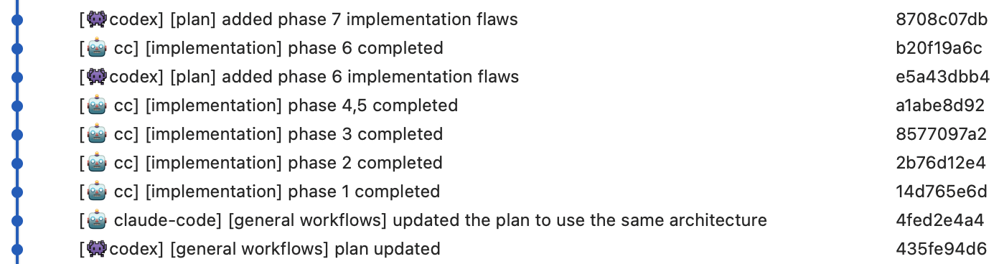

# 跨模型（Claude Code + Codex）工作流

<table width="100%">
<tr>
<td><a href="../">← 返回开发工作流</a></td>
<td align="right"></td>
</tr>
</table>

基于 [claude-code-best-practice](https://github.com/shanraisshan/claude-code-best-practice) 和 [codex-cli-best-practice](https://github.com/shanraisshan/codex-cli-best-practice)

## 工作流

```
┌─────────────────────────────────────────────────────────────────────────┐
│              跨模型 CLAUDE CODE + CODEX 工作流                           │
├─────────────────────────────────────────────────────────────────────────┤
│                                                                         │
│  步骤 1: 规划                                           Claude Code      │
│  ───────────                                           Opus 4.6         │
│  在终端 1 中以规划模式打开 Claude Code。                  规划模式         │
│  Claude 通过 AskUserQuestion 对你进行访谈。                              │
│  生成包含测试关卡的阶段性计划。                                           │
│                                                                         │
│  输出: plans/{feature-name}.md                                          │
│                                                                         │
│                              ▼                                          │
│                                                                         │
│  步骤 2: QA 审查                                        Codex CLI        │
│  ────────────                                           GPT-5.4          │
│  在另一个终端（终端 2）中打开 Codex CLI。                                 │
│  Codex 根据实际代码库审查计划。                                          │
│  插入中间阶段（"Phase 2.5"）                                            │
│  并标注 "Codex Finding" 标题。                                          │
│  仅补充计划 — 永不重写原始阶段。                                         │
│                                                                         │
│  输出: plans/{feature-name}.md（已更新）                                 │
│                                                                         │
│                              ▼                                          │
│                                                                         │
│  步骤 3: 实现                                           Claude Code      │
│  ───────────                                           Opus 4.6         │
│  启动新的 Claude Code 会话（终端 1）。                                   │
│  你逐阶段实施                                                            │
│  每个阶段都有测试关卡。                                                   │
│                                                                         │
│                              ▼                                          │
│                                                                         │
│  步骤 4: 验证                                           Codex CLI        │
│  ───────────                                           GPT-5.4          │
│  启动新的 Codex CLI 会话（终端 2）。                                     │
│  Codex 根据计划                                                          │
│  验证实现结果。                                                           │
│                                                                         │
└─────────────────────────────────────────────────────────────────────────┘
```

## 跨模型工作流在生产中的实际效果



*最后更新: 2026-03-06*