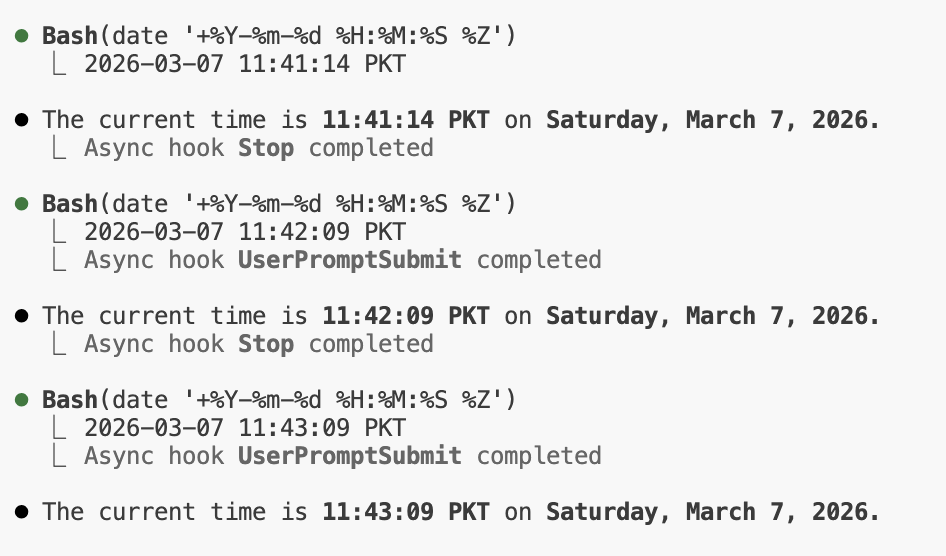

# 定时任务实现


<table width="100%">
<tr>
<td><a href="../">← 返回 Claude Code 最佳实践</a></td>
<td align="right"></td>
</tr>
</table>

---

<a href="#loop-demo"></a>

`/loop` 技能用于按 cron 间隔调度重复执行的任务。下面演示 `/loop 1m "tell current time"` —— 一个每分钟执行一次的简单定时任务。

---

## Loop 演示

### 1. 创建定时任务

<p align="center">
  
</p>

`/loop 1m "tell current time"` 会解析间隔（`1m` → 每 1 分钟）、创建 cron 任务并确认调度。要点：

- Cron 的最小粒度为 **1 分钟** —— `1m` 对应 `*/1 * * * *`
- 重复任务 **在 3 天后自动过期**
- 任务**按会话作用域** —— 仅存在于内存中，Claude 退出即停止
- 随时可用 `cron cancel <job-id>` 取消

---

### 2. 运行中的 Loop

<p align="center">
  
</p>

任务每分钟触发一次，执行 `date` 并报告当前时间。每次执行都会异步触发 **UserPromptSubmit** 和 **Stop** 钩子 —— 与本仓库中用于声音通知的钩子系统相同。

---

## 

```bash
$ claude
> /loop 1m "tell current time"
> /loop 5m /simplify
> /loop 10m "check deploy status"
```

---

## 

`/loop` 是 Claude Code 内置技能，无需额外配置。底层通过 cron 相关工具（`CronCreate`、`CronList`、`CronDelete`）管理重复调度。
