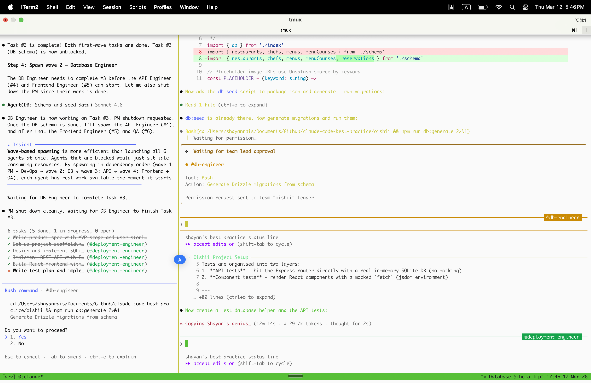

# Agent Teams Implementation


<table width="100%">
<tr>
<td><a href="../">← Back to Claude Code Best Practice</a></td>
<td align="right"></td>
</tr>
</table>

---

<a href="#asian-fine-dining-app"></a>

<p align="center">
  
</p>

Agent Teams spawn **multiple independent Claude Code sessions** that coordinate via a shared task list. Unlike subagents (isolated context forks within one session), each teammate gets its own full context window with CLAUDE.md, MCP servers, and skills loaded automatically.

---

## 

```bash
tmux new -s oishii
CLAUDE_CODE_EXPERIMENTAL_AGENT_TEAMS=1 claude
```

---

## 

### 1. Install [iTerm2](https://iterm2.com/) and tmux

```bash
brew install --cask iterm2
brew install tmux
```

### 2. Start iTerm2 → tmux → Claude

```bash
tmux new -s dev
CLAUDE_CODE_EXPERIMENTAL_AGENT_TEAMS=1 claude
```

### 3. Prompt with team structure

<a id="asian-fine-dining-app"></a>

```text
Create an agent team to build "Oishii" — an Asian fine dining restaurant
discovery app. The app lets users browse curated Asian fine dining restaurants,
filter by cuisine (Japanese, Chinese, Thai, Korean, Vietnamese, Indian),
view chef profiles, read tasting menu details, and make reservations.

Assign these teammates:

1. **Product Manager** — Define the MVP scope, write user stories for the
   core flows (browse restaurants, filter by cuisine, view restaurant detail,
   make a reservation). Create a product spec in docs/product-spec.md with
   acceptance criteria for each story. Coordinate with other teammates via
   the shared task list to unblock them.

2. **Senior Backend Engineer (API)** — Design and implement the REST API
   using Node.js/Express with TypeScript. Create the data models
   (Restaurant, Chef, Menu, Reservation), seed data with 12 curated Asian
   fine dining restaurants across 6 cuisines, and implement endpoints:
   GET /restaurants (with cuisine filter), GET /restaurants/:id,
   POST /reservations. Write the API in src/api/.

3. **Senior Backend Engineer (Database)** — Set up the SQLite database
   schema with Drizzle ORM. Create migrations, define relations between
   tables, and implement the repository layer in src/db/. Coordinate with
   the API engineer via tasks to agree on the data model interface.

4. **Frontend Engineer** — Build the React frontend with Tailwind CSS in
   src/app/. Create pages: restaurant listing with cuisine filter chips,
   restaurant detail with chef bio and tasting menu, and a reservation
   form modal. Use elegant typography and a dark theme befitting fine dining.
   Consume the API endpoints defined by the backend team.

5. **Deployment Engineer** — Set up the project scaffolding (package.json,
   tsconfig, vite config), Docker Compose for local dev (app + db),
   and a GitHub Actions CI pipeline (.github/workflows/ci.yml) that runs
   lint, typecheck, and tests. Write a README.md with setup instructions.

6. **QA Engineer** — Write end-to-end tests using Vitest for the API
   (test all endpoints, edge cases like invalid cuisine filter, double
   booking same time slot) and component tests for the React frontend.
   Create a test plan in docs/test-plan.md. Run the test suite and
   report failures to the team via tasks.

Each teammate should create tasks in the shared task list to coordinate
dependencies (e.g., Backend DB must finish schema before API can seed data,
API must be running before Frontend can integrate, QA needs both running
before e2e tests). Start with Product Manager and Deployment Engineer
in parallel, then fan out to the rest.
```

### Team Coordination Flow

```
┌─────────────────────────────────────────────────────────────┐
│                        LEAD (You)                           │
│              "Create an agent team to build Oishii..."      │
└──────────────────────────┬──────────────────────────────────┘
                           │ spawns team
              ┌────────────┴────────────┐
              ▼                         ▼
     ┌─────────────────┐     ┌──────────────────┐
     │  Product Manager │     │ Deployment Eng.  │
     │  docs/spec.md    │     │ scaffolding,     │
     │  user stories    │     │ Docker, CI       │
     └────────┬────────┘     └────────┬─────────┘
              │ tasks: stories ready          │ tasks: project ready
              ▼                               ▼
     ┌──────────────────────────────────────────┐
     │          Shared Task List                │
     │  ☐ Schema defined (DB → API)             │
     │  ☐ Seed data loaded (API)                │
     │  ☐ API endpoints live (API → FE)         │
     │  ☐ UI components done (FE → QA)          │
     └──────────────────────────────────────────┘
              │                    │
    ┌─────────┴──────┐   ┌────────┴────────┐
    ▼                ▼   ▼                  ▼
┌──────────┐ ┌──────────┐ ┌────────────┐ ┌────────┐
│ Backend  │ │ Backend  │ │  Frontend  │ │   QA   │
│ (DB)     │ │ (API)    │ │  Engineer  │ │Engineer│
│ src/db/  │ │ src/api/ │ │  src/app/  │ │ tests/ │
└──────────┘ └──────────┘ └────────────┘ └────────┘
```

